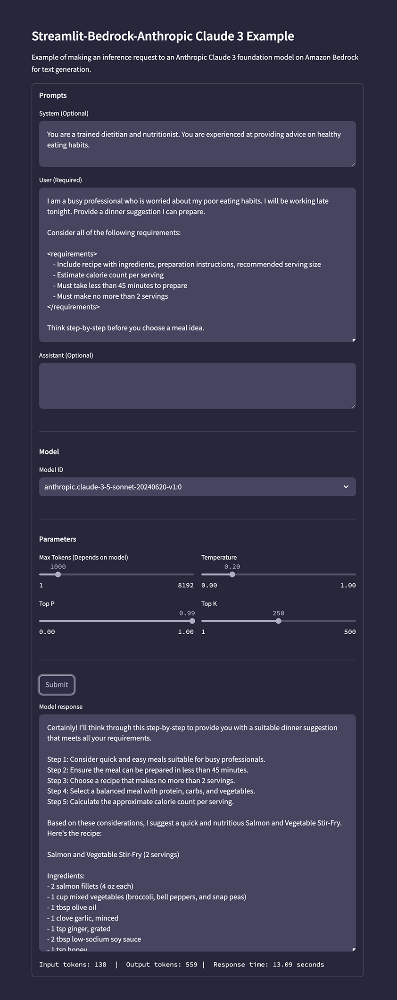

# Streamlit, Amazon Bedrock, Anthropic Claude 3 Example Application

Simple [Streamlit](https://streamlit.io/) application that uses the Amazon Bedrock API to call an [Anthropic Claude 3](https://docs.aws.amazon.com/bedrock/latest/userguide/model-parameters-anthropic-claude-messages.html) foundation model of your choice.

## Foundation Model Access

Ensure you have access to the Anthropic Claude 3 family of models in the Model access tab of the [Amazon Bedrock](https://us-east-1.console.aws.amazon.com/bedrock/home) Web Console.

## Prepare Local Environment

Create Python virtual environment locally and install required packages (1x only). Script assume you already have a recent version of [Python 3](https://www.python.org/downloads/) installed and use a `python3` alias.

```sh
sh ./env_setup.sh
```

## Authenticate to AWS

Provided your AWS credential on the commandline or authenticate in your normal way before starting the application.

```sh
export AWS_ACCESS_KEY_ID="<YOUR_AWS_ACCESS_KEY_ID>"
export AWS_SECRET_ACCESS_KEY="<YOUR_AWS_SECRET_ACCESS_KEY>"
export AWS_SESSION_TOKEN="<YOUR_AWS_SESSION_TOKEN>"
```

## Run Streamlit Application

Start the Streamlit application. The application should start locally on `http://localhost:8501` and open in your browser automatically. View the terminal output for more information.

```sh
streamlit run app.py --server.runOnSave true
```

You can [pass custom arguments](https://docs.streamlit.io/develop/api-reference/cli/run) to Streamlit when starting the application. For example:

Light mode example:

```sh
streamlit run app.py \
    --server.runOnSave true \
    --theme.base "light" \
    --theme.backgroundColor "#ffffff" \
    --theme.primaryColor "#1455ba" \
    --theme.secondaryBackgroundColor "#e8e8e8" \
    --theme.font "sans serif"\
    --ui.hideTopBar "true" \
    --client.toolbarMode "minimal"
```

Dark mode example:

```sh
streamlit run app.py \
    --server.runOnSave true \
    --theme.base "dark" \
    --theme.backgroundColor "#26273B" \
    --theme.primaryColor "#ACADC1" \
    --theme.secondaryBackgroundColor "#454560" \
    --theme.font "sans serif"\
    --ui.hideTopBar "true" \
    --client.toolbarMode "minimal"
```

## Application Preview

Video preview of application on [YouTube](https://youtu.be/TpCK2gXBgys?si=QGupf4gQr34keDHv).

Screengrabs of the application using dark mode example run command.



## Prompt Examples

### Example 1

System

```text
You are an Auctioneer.
```

User

```text
Sell me a used car with the following specifications.

<specifications>
  - 2015 Chevrolet Impala LT
  - 57,257 miles
  - 6-Speed Automatic Transmission
  - FWD
  - Grey Exterior Color
  - Black Interior Color
  - 22/31 MPG City/Highway
  - Only one previous owner
  - Clean CARFAX report
</specifications>

Don't provide details about the car that are not part of the specifications provided.
```

Assistant

```text
```

### Example 2

Reference: <https://docs.anthropic.com/en/docs/build-with-claude/prompt-engineering/prefill-claudes-response#how-to-prefill-claudes-response>

System

```text
```

User

```text
What is your favorite color?
```

Assistant

```text
As an AI assistant, I don't have a favorite color, But if I had to pick, it would be green because
```

